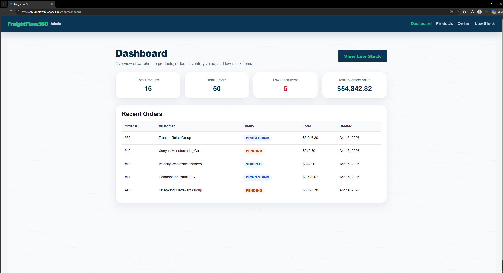

## Live Demo

FreightFlow-360: https://freightflow360.pages.dev/

# FreightFlow 360

FreightFlow 360 is a logistics-inspired full-stack web application built with Angular and Spring Boot. It combines a public-facing freight company style website with a working admin portal for managing products, inventory, low-stock items, customer orders, and dashboard summaries.

The project started as a rebuilt Warehouse Order and Inventory Management Portal. After the rebuilt version became stable, it was copied into a new private repo named **FreightFlow 360** so the design and workflows could be customized safely without breaking the original backup project.

A big reason behind the new branding came from a college-organized day tour at **ArcBest**. During that tour, I saw how a real logistics company presents its services, operations, technology, and transportation workflows. That experience helped me see how my basic warehouse project could be turned into a more complete company-style logistics platform. FreightFlow 360 is an independent student/developer project and is not affiliated with ArcBest.

---

## Project Purpose

The goal of FreightFlow 360 is to turn a simple warehouse management project into a polished full-stack logistics platform prototype.

The project demonstrates:

- Angular frontend development
- Spring Boot backend development
- REST API design
- SQL database modeling
- Full-stack integration
- Inventory and order business logic
- Deployment using Aiven, Render, and Cloudflare
- A real project story that shows how the idea evolved

---

## Project Highlights

- Logistics-style public website with pages for shippers, carriers, technology, company info, careers, contact, and shipment tracking
- Working admin dashboard backed by real API data
- Product management with add, edit, search, and safe delete behavior
- Inventory tracking and low-stock workflow
- Order creation with multiple products
- Inventory reduction after order creation
- Order details page with itemized totals
- Order status updates
- REST API communication between Angular and Spring Boot
- SQL database persistence
- Deployment setup using Aiven, Render, and Cloudflare

---

## Tech Stack

### Frontend

- Angular
- TypeScript
- HTML
- CSS
- Angular routing
- Angular services
- Form validation

### Backend

- Java
- Spring Boot
- Spring Web
- Spring Data JPA
- DTOs
- Service layer logic
- Validation
- Error handling
- CORS configuration

### Database and Deployment

- SQL database
- Aiven managed database hosting
- Render deployment
- Cloudflare DNS/domain setup
- GitHub source control

---

## Project Structure

```text
FreightFlow-360/
├── backend/
│   └── Spring Boot application
├── frontend/
│   └── Angular application
├── docs/
│   ├── 01-project-story.md
│   ├── 02-architecture.md
│   ├── 03-pages-and-user-flow.md
│   ├── 04-deployment.md
│   ├── 05-api-endpoints.md
│   └── 06-testing-summary.md
├── README.md
└── .gitignore
```

---

## Core Features

### Public Website

FreightFlow 360 includes a public-facing logistics website experience. This side of the app gives the project a company-style feel and includes pages such as:

- Home
- Shippers
- Carriers
- Tech
- About
- Invest
- Careers
- Contact
- Track Shipment
- Sign In/Register placeholders

The public pages were added to make the app feel closer to a real freight/logistics platform instead of only a basic admin CRUD project.

### Admin Dashboard

The dashboard displays real backend summary data:

- Total products
- Total orders
- Low-stock count
- Total inventory value
- Recent orders

### Product Management

The admin can:

- View products from the database
- Search products
- Add new products
- Edit product details
- View SKU, category, quantity, unit price, reorder level, and stock status
- Delete products when safe

Products already used in orders are protected from deletion so old order history does not break.

### Inventory and Low Stock

The low-stock workflow shows products where the quantity is less than or equal to the reorder level. The admin can refill or adjust stock. Once the product quantity becomes greater than the reorder level, it is removed from the Low Stock page.

### Order Management

The admin can:

- View all orders
- Create orders with selected products and quantities
- Prevent orders from exceeding available stock
- Reduce inventory after an order is created
- View order details
- Update order status

Supported order statuses:

```text
PENDING
PROCESSING
SHIPPED
CANCELLED
```

---

## Database Overview

FreightFlow 360 uses three main tables:

```text
products
orders
order_items
```

### products

Stores product details and current inventory quantity.

### orders

Stores main order information such as customer name, status, total amount, and order date.

### order_items

Stores the products inside each order. This allows one order to contain multiple products.

---

## API Overview

The backend exposes REST APIs for the main workflows.

| Area | Example Endpoints |
|---|---|
| Products | `GET /api/products`, `POST /api/products`, `PUT /api/products/{id}`, `DELETE /api/products/{id}` |
| Inventory | `GET /api/inventory/low-stock`, `PUT /api/inventory/{productId}/adjust` |
| Orders | `GET /api/orders`, `POST /api/orders`, `GET /api/orders/{id}`, `PUT /api/orders/{id}/status` |
| Dashboard | `GET /api/dashboard/summary` |

Full API details are available in [`docs/05-api-endpoints.md`](docs/05-api-endpoints.md).

---

## Screenshots

Add screenshots here after capturing the deployed or local app.

Suggested screenshots:

```text
docs/screenshots/home-page.png
docs/screenshots/dashboard.png
docs/screenshots/products-page.png
docs/screenshots/low-stock-page.png
docs/screenshots/create-order-page.png
docs/screenshots/order-details-page.png
```

Example format:

```md

```

---

## Local Setup

### Prerequisites

Install the following before running the project locally:

- Java 17 or later
- Maven
- Node.js
- Angular CLI
- SQL database
- Git

---

## Backend Setup

From the project root:

```bash
cd backend
```

Create or update your backend application configuration with your database connection.

Example local configuration:

```properties
spring.datasource.url=jdbc:postgresql://localhost:5432/freightflow360
spring.datasource.username=your_username
spring.datasource.password=your_password
spring.jpa.hibernate.ddl-auto=update
spring.jpa.show-sql=true
```

Run the backend:

```bash
mvn spring-boot:run
```

The backend should start on:

```text
http://localhost:8080
```

---

## Frontend Setup

From the project root:

```bash
cd frontend
npm install
ng serve
```

The frontend should start on:

```text
http://localhost:4200
```

Make sure the Angular API base URL points to the Spring Boot backend.

Example:

```ts
apiUrl = 'http://localhost:8080/api';
```

---

## Deployment Overview

FreightFlow 360 was deployed using:

- **Aiven** for managed SQL database hosting
- **Render** for backend/frontend hosting
- **Cloudflare** for DNS and domain management

The deployed system follows this flow:

```text
User Browser
   ↓
Angular Frontend
   ↓ REST API calls
Spring Boot Backend
   ↓ SQL queries
Aiven Database
```

Cloudflare manages the custom domain and DNS routing.

More deployment notes are available in [`docs/04-deployment.md`](docs/04-deployment.md).

---

## Documentation

| File | Purpose |
|---|---|
| [`docs/01-project-story.md`](docs/01-project-story.md) | Explains the project background, rebuild story, ArcBest tour inspiration, and FreightFlow 360 branding |
| [`docs/02-architecture.md`](docs/02-architecture.md) | Explains frontend, backend, database, API flow, and deployment architecture |
| [`docs/03-pages-and-user-flow.md`](docs/03-pages-and-user-flow.md) | Documents all public website pages and admin portal workflows |
| [`docs/04-deployment.md`](docs/04-deployment.md) | Explains Aiven, Render, Cloudflare, environment variables, and deployment issues |
| [`docs/05-api-endpoints.md`](docs/05-api-endpoints.md) | Documents product, inventory, order, and dashboard APIs |
| [`docs/06-testing-summary.md`](docs/06-testing-summary.md) | Summarizes end-to-end testing completed for the app |

---

## Future Improvements

Future versions could add:

- Role-based access control
- Real shipment tracking data
- Carrier assignment workflow
- Supplier management
- Inventory transaction history
- CSV export
- Pagination and filters
- Docker setup
- GitHub Actions CI/CD
- Unit and integration tests
- More complete public website content
- Admin analytics charts

---

## Project Status

FreightFlow 360 is a working full-stack project with connected frontend, backend, database, and deployment setup. The project is still open for improvements, but the main Version 1 workflows are complete.

